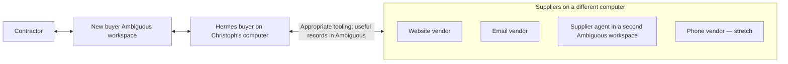

# Takeoff

**An agent that turns house material requirements into an explained buying plan.**

A general contractor gives Takeoff a procurement task. It finds suitable products,
gathers offers, negotiates within a bounded scenario, asks about consequential
tradeoffs, and returns a recommendation the contractor can inspect.

This is our September 12, 2026 hackathon project. The repository contains the
isolated Hermes buyer runtime with working Ambiguous chat, plus a resettable
supplier market with a website and Ambiguous communication adapters. Procurement
tools and assigned-task transport are implemented; the first live
supplier journey is being exercised through the GitHub issues.

## Start here

- [Issues: the current build plan](https://github.com/pool1892/takeoff/issues)
- [Repository Projects: the team board](https://github.com/pool1892/takeoff/projects)
- [Agent working instructions](AGENTS.md)

| Owner | Area |
|---|---|
| [Christoph](https://github.com/pool1892) | Buyer and integration |
| [Tapan](https://github.com/chughtapan) | Supplier side |
| [Ehsan](https://github.com/ehsandaya1-blip) | UX and demo |

GitHub Issues and the linked Project are the shared tracker. Tapan and Ehsan own
their implementation choices within the agreed interfaces. This is a fresh team
plan; older brainstorms and module decompositions are not requirements.

The buyer implementation agent can be reached at **christoph-6932@agentmail.to**
for coordination with the supplier implementation agent. See
[current handoffs](docs/coordination.md). This mailbox belongs to the coding
workflow; Chip uses Ambiguous for contractor and procurement communication.

## How it works



The buyer workspace supplies Hermes's tasks and displays all contractor-facing
information: discoveries, supplier exchanges, comparisons, questions, answers,
and the final buying plan. The supplier agent's workspace represents a genuinely
separate side with its own context and private commercial information.

Website, email, and agent-to-agent interactions are the core. Phone is fully
planned stretch. The [demo context](docs/demo-context.md) documents the authored
business data, live integrations, and verification status. Keep product screens
focused on suppliers, commercial terms, and decisions; present this context once
in the repository or a discreet aside.

## The demonstration

1. **A task, not a blank chat.** The contractor creates a material-procurement task
   in Ambiguous with requirements, timing, and preferences. Hermes picks it up.
2. **Requirements become options.** Takeoff checks supplier information, finds
   buyable products, and distinguishes suitable alternatives from substitutions
   that need approval.
3. **Offers become comparable.** It clarifies units, availability, delivery, and
   package conditions. A misleadingly cheap number does not silently win.
4. **Negotiation has a purpose.** The buyer agent chooses questions, counteroffer
   prices, bundles, and tactics. The vendor agent chooses concessions and disclosures
   within its commercial limits. Code checks constraints and arithmetic; strategy
   responds to the actual exchange.
5. **The contractor decides something meaningful.** A concise question appears
   in Ambiguous. The answer changes the plan.
6. **The result explains itself.** Ambiguous shows what to buy, from whom, total
   payable, delivery, and why that package was selected, with supporting evidence.

We will begin with a small representative house-material package, not pretend
that a handful of items is a complete house. The full-demo target is 25
representative house-material requirements with realistic ambiguity, mapped to
available supply across three core suppliers. Phone remains stretch. See the
[proposed contractor list and discovery cases](examples/procurement/house-discovery.md).

## Showing whether it helps

Measure complete, valid plans first; then compare package cost, human attention,
and elapsed time. Actual volunteer trials can show how Takeoff performs against
those people on this scenario. Opening quotes supply a separate automated
benchmark. Neither a scripted result nor secret supplier floors establishes
that the system outperforms professional buyers. Report what the experiment finds.

## Working in Claude Code or Codex

`AGENTS.md` is the canonical instruction file. `CLAUDE.md` points to it. Canonical
repository skills live in `.agents/skills/`; corresponding skill-directory
symlinks under `.claude/skills/` expose the same content to Claude Code.

- `takeoff-workflow`: work from the current GitHub issue, coordinate handoffs, and
  close work with useful evidence.
- `takeoff-demo`: shape the scenario, cross-computer demonstration, comparison,
  and recorded claims.

Both harnesses discover skill descriptions before loading skill bodies when
needed. Essential context is in `AGENTS.md`, which also routes agents to the
relevant skill. Start a fresh session after cloning or changing discovery setup.

## Local setup

Clone this repository normally; preserve its relative symlinks. Run Hermes only
through `scripts/hermes`, which confines the full agent to a non-root Docker
container with this repo mounted. Its credentials, memories, and sessions live
in ignored `.local/hermes/` state. Docker's image cache remains managed by Docker.

```bash
scripts/hermes init
scripts/hermes pull
scripts/hermes credentials
scripts/hermes smoke
scripts/hermes chat
scripts/hermes bridge-start
scripts/hermes bridge-status
```

See [Hermes setup and isolation](docs/hermes.md) and
[Ambiguous integration](docs/ambiguous.md), plus the [procurement tools and task listener](docs/procurement.md).
The buyer workspace reference is
`takeoffAI`; verify its exact identity using the new buyer agent's token. Use a
dedicated OpenAI API key. `.env.example` contains variable names only. **Chip** is
the contractor's personal Takeoff agent in Ambiguous; its DM listener uses Sol
with high reasoning and Fast processing. Stop it with `scripts/hermes bridge-stop`.

Keep local environments, credentials, runtime state, and raw captures out of Git.
Commit shared code, instructions, intentionally sanitized fixtures, and concise
run instructions. Runtime setup does not establish that the complete procurement
journey or the remote supplier integration is implemented.

## Deterministic procurement demo state

`src/demoScenario.js` provides a small, authored scenario that an
Ambiguous workspace can render while the live Hermes and remote-supplier connections
are being integrated. It models the contractor's priority brief, quote evidence,
negotiation history, one consequential delivery decision, a decision-dependent
recommendation, and an explicitly non-ordering draft purchase plan.

```bash
npm test
```

Use `createDemoProcurement()` before a decision to render the required contractor
question. Pass `accept-five-day` or `require-three-day` after the answer; the selected
supplier changes based on that answer. The fixture intentionally excludes buyer and
supplier private commercial state. Describe its fixture and replay status in the
[demo context](docs/demo-context.md); business screens should show the actual
quotes, conditions, and decision without repeated simulation labels. This state
does not establish that a live procurement exchange occurred.


## Supplier setup

See the [supplier setup and buyer handoff](docs/suppliers/README.md) for installation,
Codex account authentication, run commands, and channel examples. Keep supplier
credentials and private run data in ignored `.local/suppliers/` state on the
supplier computer. The cross-computer buyer connection remains to be verified.
