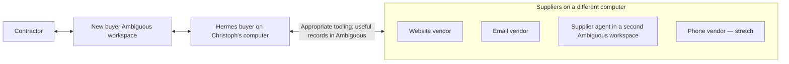

# Takeoff

**An agent that turns house material requirements into an explained buying plan.**

A general contractor gives Takeoff a procurement task. It finds suitable products,
gathers offers, negotiates within a bounded scenario, asks about consequential
tradeoffs, and returns a recommendation the contractor can inspect.

This is our September 12, 2026 hackathon project. The current repository contains
the shared project setup; product implementation follows the GitHub plan.

## Start here

- [Issues: the current build plan](https://github.com/pool1892/takeoff/issues)
- [Repository Projects: the team board](https://github.com/pool1892/takeoff/projects)
- [Agent working instructions](AGENTS.md)

| Owner | Area |
|---|---|
| [Christoph](https://github.com/pool1892) | Buyer and integration |
| [Tapan](https://github.com/chughtapan) | Supplier side |
| [Ehsan](https://github.com/ehsandaya1-blip) | UX and demo |

GitHub Issues and the linked Project are the shared tracker. Tapan and Ehsan own
their implementation choices within the agreed interfaces. This is a fresh team
plan; older brainstorms and module decompositions are not requirements.

## How it works

The buyer workspace supplies Hermes's tasks and displays all contractor-facing
information: discoveries, supplier exchanges, comparisons, questions, answers,
and the final buying plan. The supplier agent's workspace represents a genuinely
separate side with its own context and private commercial information.

Website, email, and agent-to-agent interactions are the core. Phone is fully
planned stretch. Vendor businesses and commercial data can be simulated while
the communication between computers is real; the demo will distinguish those.

## The demonstration

1. **A task, not a blank chat.** The contractor creates a material-procurement task
   in Ambiguous with requirements, timing, and preferences. Hermes picks it up.
2. **Requirements become options.** Takeoff checks supplier information, finds
   buyable products, and distinguishes suitable alternatives from substitutions
   that need approval.
3. **Offers become comparable.** It clarifies units, availability, delivery, and
   package conditions. A misleadingly cheap number does not silently win.
4. **Negotiation has a purpose.** A bounded playbook guides questions, competing
   offers, bundles, and delivery tradeoffs. Decisions respond to the actual facts.
5. **The contractor decides something meaningful.** A concise question appears
   in Ambiguous. The answer changes the plan.
6. **The result explains itself.** Ambiguous shows what to buy, from whom, total
   payable, delivery, and why that package was selected, with supporting evidence.

We will begin with a small representative house-material package, not pretend
that a handful of items is a complete house. A proposed starting point is eight
requirements and three core suppliers, with a phone supplier as stretch.

## Showing whether it helps

Measure complete, valid plans first; then compare package cost, human attention,
and elapsed time. Actual volunteer trials can show how Takeoff performs against
those people on this scenario. Opening quotes supply a separate automated
benchmark. Neither a scripted result nor secret supplier floors establishes
that the system outperforms professional buyers. Report what the experiment finds.

## Working in Claude Code or Codex

`AGENTS.md` is the canonical instruction file. `CLAUDE.md` points to it. Canonical
repository skills live in `.agents/skills/`; corresponding skill-directory
symlinks under `.claude/skills/` expose the same content to Claude Code.

- `takeoff-workflow`: work from the current GitHub issue, coordinate handoffs, and
  close work with useful evidence.
- `takeoff-demo`: shape the scenario, cross-computer demonstration, comparison,
  and recorded claims.

Both harnesses discover skill descriptions before loading skill bodies when
needed. Essential context is in `AGENTS.md`, which also routes agents to the
relevant skill. Start a fresh session after cloning or changing discovery setup.

## Local setup

Clone this repository normally; preserve its relative symlinks. Use an isolated
Takeoff Hermes home and the new workspace references being provisioned by the
team. `.env.example` describes local configuration hygiene; exact adapter
variables and run commands will be documented when those integrations exist.

Keep local environments, credentials, runtime state, and raw captures out of Git.
Commit shared code, instructions, intentionally sanitized fixtures, and concise
run instructions. There are no product install or run commands to claim yet.
